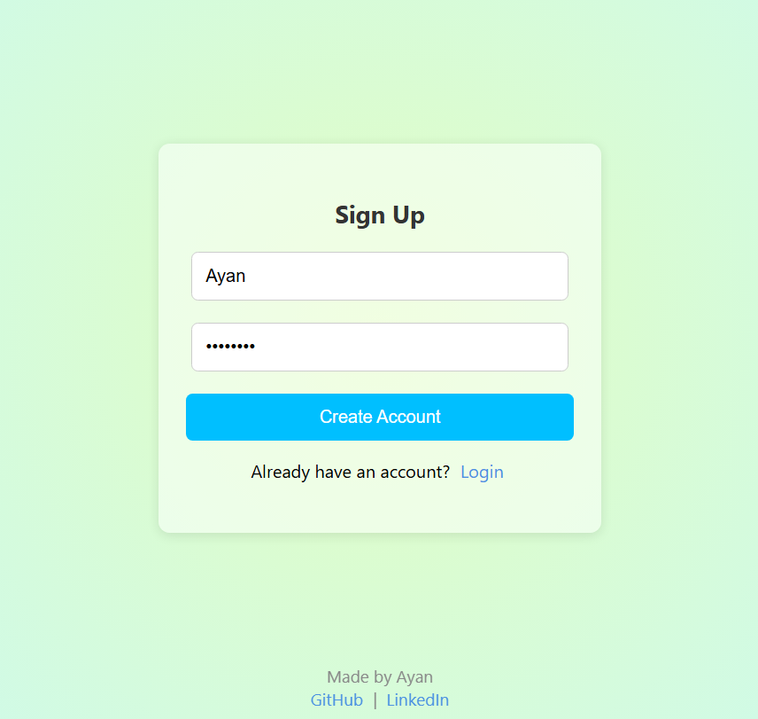
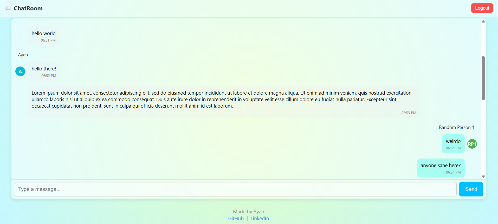

# 💬 EchoRoom

_A glowing real-time chat app built with Node.js, Socket.IO, MongoDB, and pure JavaScript magic ✨_

> 🌐 [Try it!](https://echoroom.onrender.com)

---

## 🚀 Features

- 🔐 **Secure Auth**: User signup/login with hashed passwords (bcrypt)
- 🍪 **Persistent Login**: Cookie-based session authentication
- 💬 **Real-time Messaging**: Instant Socket.IO chat
- 📜 **Message History**: MongoDB stores all chat logs
- 👥 **User Grouping**: Messages grouped with avatars & timestamps
- 🧠 **Typing Indicator**: Animated “...” while users type
- 🎨 **Responsive UI**: Neon-themed, mobile-first design
- ⚠️ **Validation & Feedback**: Inline error alerts on auth
- 📂 **Project Config**: Environment-based settings via `.env`

---

## 📸 Screenshots

<div align="center">


<br><br>


</div>

---

## 🧩 Tech Stack

- **Backend**: Node.js, Express
- **Real-Time Engine**: Socket.IO
- **Database**: MongoDB + Mongoose
- **Authentication**: bcrypt + cookies
- **Frontend**: HTML5, CSS3, Vanilla JS
- **Deployment**: Render.com
- **Security**: Input validation + session-based access control

---

## 🛠️ Getting Started

1. **Clone the repository**
   ```bash
   git clone https://github.com/ayannotfound/EchoRoom.git
   cd EchoRoom
   ```

2. **Install dependencies**
   ```bash
   npm install
   ```

3. **Create a `.env` file**
   ```env
   MONGO_URI=your_mongodb_connection_string
   ```

4. **Run the server**
   - Production:
     ```bash
     npm start
     ```
   - Development:
     ```bash
     npm run dev
     ```

---

## 🎮 How to Use

1. Open the app and create a new account or log in
2. Chat in real time with others
3. Messages display grouped by user, with timestamps and avatars
4. Typing indicator shows when users are typing
5. Responsive neon-themed layout that adapts to all screen sizes

---

## 🧠 What I Learned

- Building real-time apps with Socket.IO
- Securing authentication with bcrypt and cookies
- MongoDB schema design and message persistence
- Creating smooth, grouped chat UIs in vanilla JavaScript
- Implementing typing indicators and user grouping logic

---

## 📁 Project Structure

```
EchoRoom/
├── models/
│   ├── Message.js
│   └── User.js
├── public/
│   ├── index.html
│   ├── login.html
│   ├── signup.html
│   ├── login.css
│   ├── style.css
│   └── script.js
├── .env.example
├── server.js
├── package.json
└── README.md
```

---

## 🔧 NPM Scripts

```json
"scripts": {
  "start": "node server.js",
  "dev": "nodemon server.js"
}
```

---

## ✨ Planned Features

- 🖼️ Avatar uploads
- 📎 File/image sharing
- 🔔 Notification sounds

---

## 📫 Connect With Me

[GitHub](https://github.com/ayannotfound)
[LinkedIn](https://www.linkedin.com/in/ayush-anand-420590306/)  

---

## 📄 License

MIT License — free to fork, build, and deploy your own EchoRoom.
