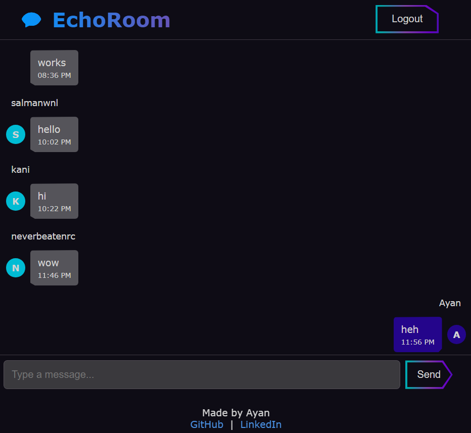

# 💬 Chat App

A full-stack real-time chat application with authentication, built using:

- Node.js + Express
- Socket.IO
- MongoDB + Mongoose
- bcrypt for password hashing
- Cookie-based login
- HTML, CSS, and Vanilla JavaScript (no frameworks)

---

## 🚀 Features

- 🔐 User signup and login with hashed passwords
- 🍪 Cookie-based persistent authentication
- 💬 Real-time messaging using Socket.IO
- 🗂 MongoDB database for users and messages
- 📜 Message history
- 🧑 Messages grouped by user with timestamp
- 💻 Fully responsive interface (mobile-friendly)
- ⚠️ Inline popup form validation errors
- 🔧 Configurable via `.env` file

---

## 📱 How It Works

1. Users sign up or log in using email and password.
2. A secure cookie is set for authentication.
3. Once logged in, users can send and receive messages in real-time.
4. Messages are stored in MongoDB with timestamps and user references.

---

## 📷 Screenshot




---

## 🌍 Deployed Link

🔗 [Live Demo](https://chat-4wys.onrender.com)

---

## 📦 Installation

1. **Clone the repository**
   ```bash
   git clone https://github.com/ayannotfound/Chat.git
   cd Chat
   ```

2. **Install dependencies**
   ```bash
   npm install
   ```

3. **Create a `.env` file**
   ```env
   MONGO_URI=your_mongodb_connection_string
   ```

4. **Run the server**
   - Production:
     ```bash
     npm start
     ```
   - Development (with auto-reload):
     ```bash
     npm run dev
     ```

---

## 🗂 Project Structure

```
.
├── models/
│   ├── Message.js        # Message schema
│   └── User.js           # User schema with bcrypt
├── public/
│   ├── index.html        # Main chat interface
│   ├── login.html        # Login page
│   ├── signup.html       # Signup page
│   ├── login.css         # Auth styling
│   ├── style.css         # Chat styling
│   └── script.js         # Frontend chat logic
├── .env                  # MongoDB connection URI
├── server.js             # Express + Socket.IO server
├── package.json
└── README.md
```

---

## 🔧 NPM Scripts

```json
"scripts": {
  "start": "node server.js",
  "dev": "nodemon server.js",
}
```

- `npm start` — Run app normally  
- `npm run dev` — Auto-reloads with `nodemon`

---

## ✨ TODO

- Add avatars or user initials
- Add "typing..." indicator
- Add file/image upload support

---

## 🤝 Contributing

Pull requests are welcome! For major changes, please open an issue first to discuss what you'd like to change.

---

## 📄 License

This project is licensed under the MIT License.

---

## 🧑‍💻 Author

Made by [@ayannotfound](https://github.com/ayannotfound)